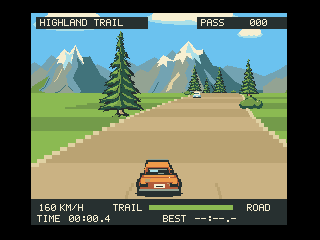
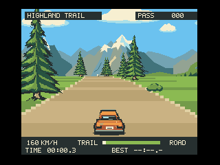

# MAGICAL HAPPY RALLY v0.5 — Terrain

大きなS字、頂上で視界が開ける登り、回り込む下りを強化したv0.5です。MSX turbo RのR800モード + V9990向け、512KiB ASCII8カートリッジ型のドライブアクションです。時間切れもゲームオーバーもありません。

[v0.5 ROM](outputs/MAGICAL_HAPPY_RALLY-v0.5.rom) · [地形改良と検証の記録](docs/TERRAIN-v0.5.md)



映像はopenMSXで動かした実ROMの連続画像です。初期位置と速度を設定した後はキー操作で走行し、ハプニングを見せない区間を選んでいます。

総合検証83/83項目に合格し、キー操作だけの一周平均は29.837fpsでした。重い区間は約27fpsで、全区間30fps固定ではありません。高速化前後の263場面・20,198,400画素で差分0を確認しています。すべてopenMSX上の結果で、実機は未検証です。

操作はSpace／↑でアクセル、←／→でハンドル、X／↓でブレーキ、Escでポーズです。操作・加減速・接触からの復帰・時計・自車画像は保持し、車体や画面を揺らす処理は追加していません。

起動には各自のopenMSXとBIOSを用意してください。エミュレーター、BIOS、コンパイラーは同梱していません。Windowsの起動ヘルパーはNode.jsを使用します。必要に応じて`OPENMSX_EXE`と`OPENMSX_SYSTEM_DATA`を設定してください。ROM単体を直接起動する場合は次の指定を使い、表示先をGFX9000にしてください。

```text
openmsx -machine Panasonic_FS-A1ST -ext gfx9000 -cart outputs/MAGICAL_HAPPY_RALLY-v0.5.rom -romtype ASCII8
```

`BUILD.cmd`または`python tools/build.py`でv0.5をビルドし、`PLAY.cmd`でv0.5を起動します。ROMは同じ512KiB ASCII8です。旧版と同時に起動する場合は、起動前に環境変数`OPENMSX_PORT`を`18798`へ設定してください。

検証環境はPython 3.13.5、Pillow 12.2.0、SDCC 4.6.0 #16555 MINGW64、Pasmo 0.5.4.beta2、Node.js 22.17.0です。SDCCとPasmoを`PATH`へ追加するか、実行ファイルを環境変数`SDCC` / `PASMO`で指定してください。再ビルド時はこのゲームのopenMSXを終了し、ROMのファイルロックを解除してください。

```text
python -m pip install Pillow==12.2.0
python tools/build.py
python tools/check_rebuild.py
python tools/check_terrain_scope.py
python tools/check_render_equivalence.py
python tools/check_span_equivalence.py
python tools/verify_terrain.py --port 18798
```

ネイティブ検証の前に、別のPowerShellで`$env:OPENMSX_PORT = "18798"`を設定して`node tools/emulator_host.mjs`を起動します。先に総合検証で起動完了を確認してください。旧検証器の入口はv0.5には使用しません。

公開物にはROM、ソース、最終検証結果、ネイティブGIF、機能確認用の静止画を収録しています。連番PNGと試験途中のファイルは非同梱です。JSON内の連番PNGパスは検証時の記録で、再撮影時に同じパスへ生成されます。

---

<details>
<summary>公開済みv0.4の参考資料・操作とゲーム内容</summary>

おんぼろカーで、少し不思議なラリーの旅へ。

MSX turbo R + V9990向けの、512KiBカートリッジ型ドライブアクションです。山道のアップダウンとカーブを走り、一般車を追い越し、ときには思いがけないハプニングに出会います。時間切れもゲームオーバーもありません。



映像はopenMSXで動かした実ROMの連続キャプチャです。カーブ、アップダウン、木立の流れを見せるために初期位置と速度だけを設定し、以降はキー入力で走行しています。旅のハプニングは、遊んでからのお楽しみです。

## ダウンロード・起動

[v0.4 ROMをダウンロード](outputs/MAGICAL_HAPPY_RALLY-v0.4.rom) — ASCII8 / 524,288バイト

対象は **MSX turbo RのR800モード + V9990** です。MSX1/MSX2やZ80モード向けではありません。現在はopenMSXで検証しており、実機は未検証です。

openMSXでは機種`Panasonic_FS-A1ST`、拡張`gfx9000`、ROM形式`ASCII8`を指定します。エミュレーター本体と必要なBIOSは各自で用意してください。このリポジトリには同梱していません。

WindowsではNode.jsとopenMSXを用意して`PLAY.cmd`を実行できます。必要に応じて環境変数`OPENMSX_EXE`に実行ファイル、`OPENMSX_SYSTEM_DATA`にopenMSXのシステムデータディレクトリーを設定してください。

ROM単体は付属ヘルパーに依存せず、openMSXから直接起動することもできます。

```text
openmsx -machine Panasonic_FS-A1ST -ext gfx9000 -cart outputs/MAGICAL_HAPPY_RALLY-v0.4.rom -romtype ASCII8
```

直接起動した場合は、表示先がGFX9000になっていることを確認してください。

## 操作

| 操作 | キーボード | ジョイスティック1 |
| --- | --- | --- |
| 開始・アクセル | Space / ↑ | トリガー1 / ↑ |
| ハンドル | ← / → | ← / → |
| ブレーキ | X / ↓ | トリガー2 / ↓ |
| 一時停止・再開 | Esc | キーボードのEsc |

アクセルを離すと徐々に減速します。同時押しではブレーキが優先です。

- 一般車は同方向の車線を走ります。空いている側から追い越しましょう。
- ハプニングには予告があります。道の先を見て、空いている側へ避けましょう。
- 接触やハプニングへの巻き込まれは短い減速と復帰だけ。旅はそのまま続きます。
- `TIME`は現在の周回、`BEST`はその起動中の最速周回です。0.1秒単位で計測し、ポーズ中は止まります。記録はリセット・終了で消えます。

<details>
<summary>遭遇イベントのヒント（ネタバレあり）</summary>

牧草地で牛が浮き始めたらUFOの予兆です。路面の予告を見て、光線と反対側へ避けてください。捕まっても車が少し浮いた後に道路へ戻り、すぐ旅を続けられます。牛が傷つく表現はありません。

</details>

## ビルド

検証に使用したビルド環境はPython 3.13.5、Pillow 12.2.0、SDCC 4.6.0 #16555 MINGW64、Pasmo 0.5.4.beta2です。起動ヘルパーはNode.js 22.17.0で確認しています。SDCCとPasmoを`PATH`へ追加するか、実行ファイルを環境変数`SDCC` / `PASMO`で指定してください。

```text
python -m pip install Pillow==12.2.0
python tools/build.py
```

Windowsでは`BUILD.cmd`も使えます。風景・車・文字・コースの生成からROM作成まで実行します。読み込み中のROMがWindowsにロックされる場合は、このゲームのopenMSXを終了してからビルドしてください。

```text
python tools/check_rebuild.py
```

この検査は資産を再生成し、再ビルド前後のROMがバイト単位で一致することを確認します。

## 検証状況

同一ROMは開発時にopenMSXで70/70項目に合格しました。公開用コピーの再検証は69/70で、周回時計と外部測定の比較1項目が要確認です。再々検証はPC側エラーで中止しており、原因は未確定です。

入力だけの一周は、開発時24.315秒・平均29.776fps、公開再検証24.465秒・平均29.757fpsでした。実機は未検証です。各実行を分けた結果と未解決点は[検証記録](docs/VERIFICATION.md)に記載しています。

ROMのSHA-256：

```text
89aea977464a8cd5f28d9ca1b83a7329d691b437f52444a06729d5588cda8291
```

[検証の詳細と再実行方法](docs/VERIFICATION.md) · [ゲームの設計と今後の方向](docs/DESIGN.md)

## 主な構成

- `src/`：MSX側の運転・遭遇イベント・時計・描画・音。
- `tools/`：資産生成、ROMビルド、openMSX起動、検証。
- `assets/`：決定的に再生成できる画像・コース資産。
- `outputs/`：ROM、対象ハッシュ付きの検証記録、ネイティブ走行映像。

風景動画の再生ではありません。入力・ゲーム状態・描画・音はすべてMSX側で動作します。

</details>
